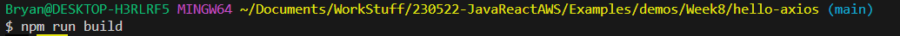

# Deploying a React App 

Deploying a React application is actually pretty simple all things considered, very minimal work we need to do to get it up and running.

1. The first step is setting up an S3 bucket for static web hosting, this will allow us to run our react app on it. 

**DISCLAIMER** Before you move on to the next step, please remember to update your HTTP requests to include the proper link (connecting to your ec2 and no longer just localhost:8080). Reuploading to an S3 bucket is significantly easier than our EC2 process but should still be avoided if possible

2. Before we can post our application, we're going to bundle all our application files together into one using `npm run build` while inside our application. This will generate a build folder whose contents we'll upload to our S3 bucket.

3. Upload the stuff inside the build folder to your S3 bucket. You should be done and should be able to access this from the S3's page and hopefully you can connect to your backend with no issues