# How to Dockerize a Spring Boot Application

1. First step here is to build a Dockerfile like seen below. it should be in the project directory on the same level as your pom.xml file. You should describe the base image, where to copy the compiled jar file to, what port you want to expose, and finally the command to run the jar. (You could also include info about environment variables or the working directory if you'd like)

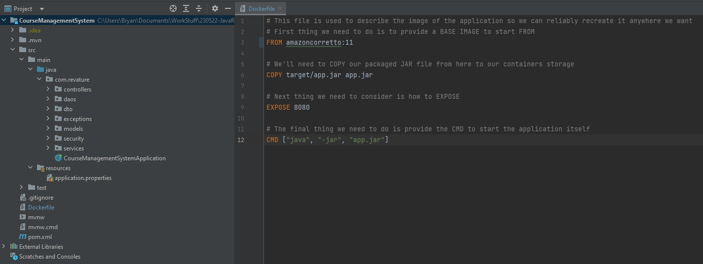

2. If you choose to use a dockerfile like the one above, make sure to update the final build name in your pom.xml. Since we'll also be moving to cloud resources for our database, we should also extract that away to an environment variable so the information is never stored publicly.

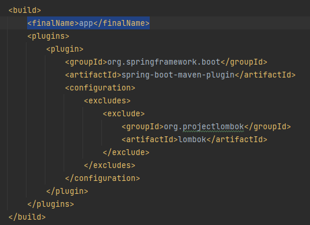
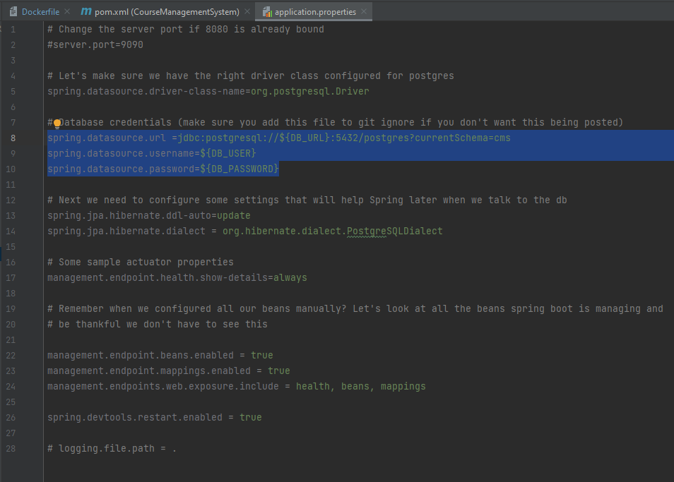

3. Open a new gitbash terminal where your project is located

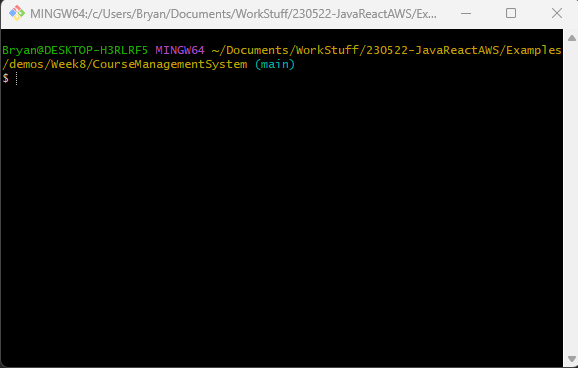

4. Verify you have Docker or Podman installed with `podman --version` (Pretty much any podman and docker command are interchangeable so don't get too hung up on one or the other)

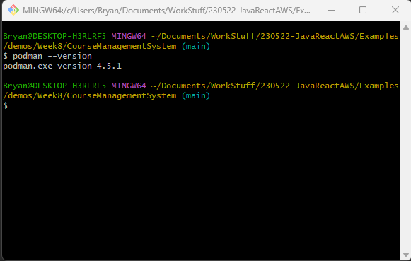

5. Before we can build our image from our Dockerfile, we need that target folder that's being accessed by the dockerfile. To do this we compile everything with a `mvn clean package`, if you utilized environment variables earlier it should look something like `mvn clean -D DB_URL=yourURLhere -D DB_USER=yourUsernameHere -D DB_PASSWORD=yourPasswordHere package`. Don't worry about passing these guys in during the package step, we just need them so we can ensure a connection can be made to our RDS.

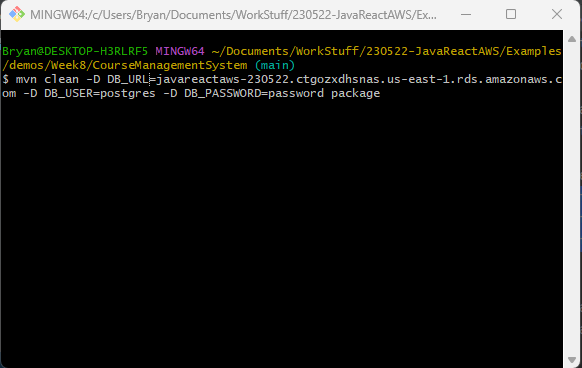

6. We're finally at the step where we can build our image. Recall that an image is a blueprint for a container, meaning we'll be able to create a lightweight image of our app that can be easily shared or deployed (you could even share it on the Docker Hub!). We build with `podman build -t name-of-your-image .`. Don't forget the . at the end, it selects the current directory for docker/podman to search through for the dockerfile.

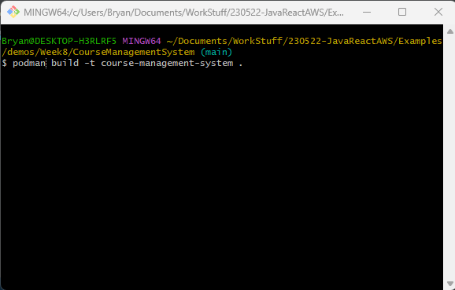

If it builds correctly, you should see each step from your dockerfile acted out in the cli

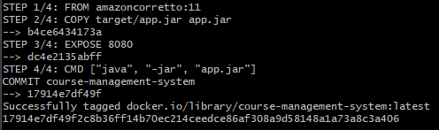

We can also verify that the image was successfully created by checking out our images with `podman images`

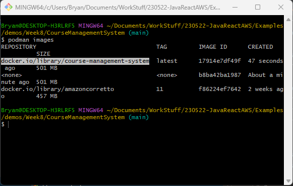

7. Finally, it's time to actually run our image and turn it into a container. This is what actually launches the app based off our specifications earlier. The general syntax follows `podman run name-of-your-image` but we can add additional flags for more config. We'll add the `-d` tag to run in detached mode (basically means the app will keep running even if we close the window). `-p ourPort:containerPort` allows us to map ports on our machine to ports on the container, we'll leverage this since we need web traffic to access the application. `-e` will function similarly to `-D` earlier and allow us to set our environment variables. All together our command looks like `podman run -d -p 9090:8080 -e DB_URL=yourURLhere -e DB_USER=yourUsernameHere -e DB_PASSWORD=yourPasswordHere name-of-your-image`

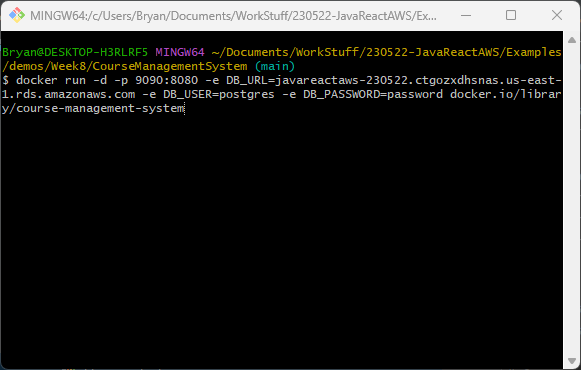

If you managed to get podman desktop to work and have it update automatically (if you couldn't get this don't be too worried) we should be able to view our running container and its associated logs through the app

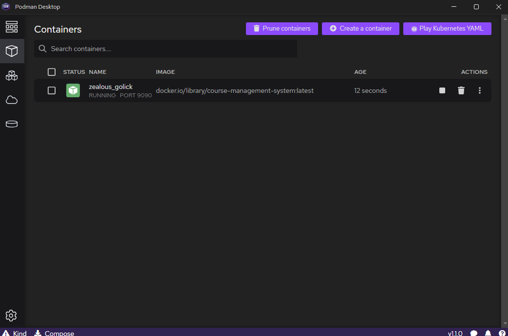