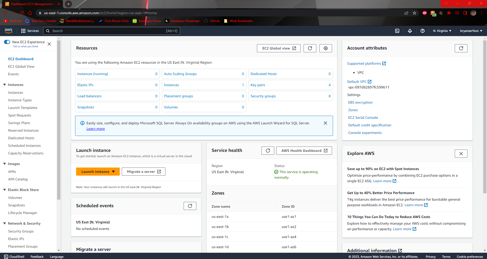
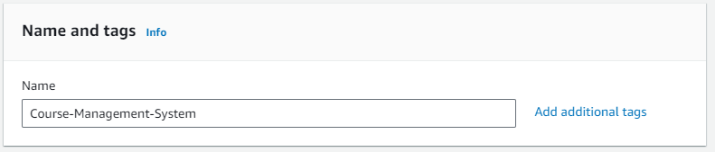
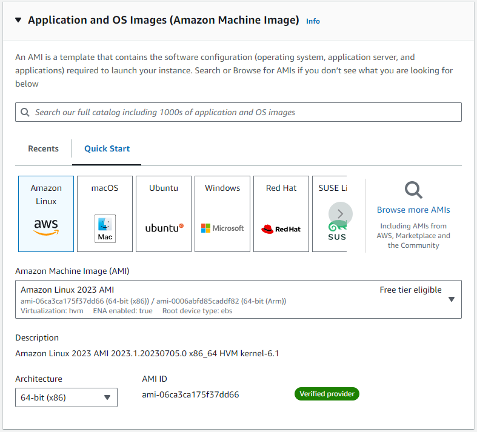
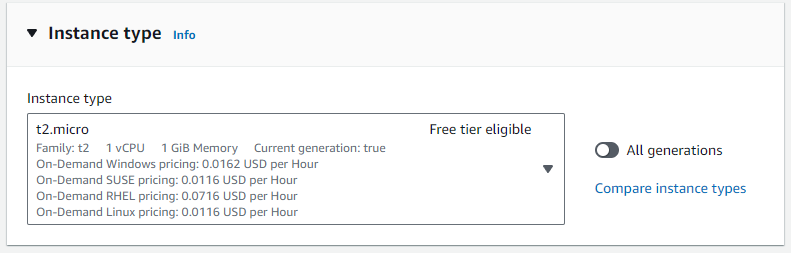
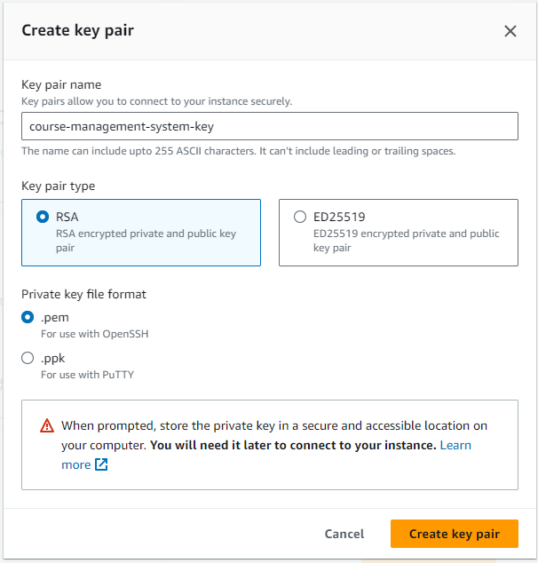
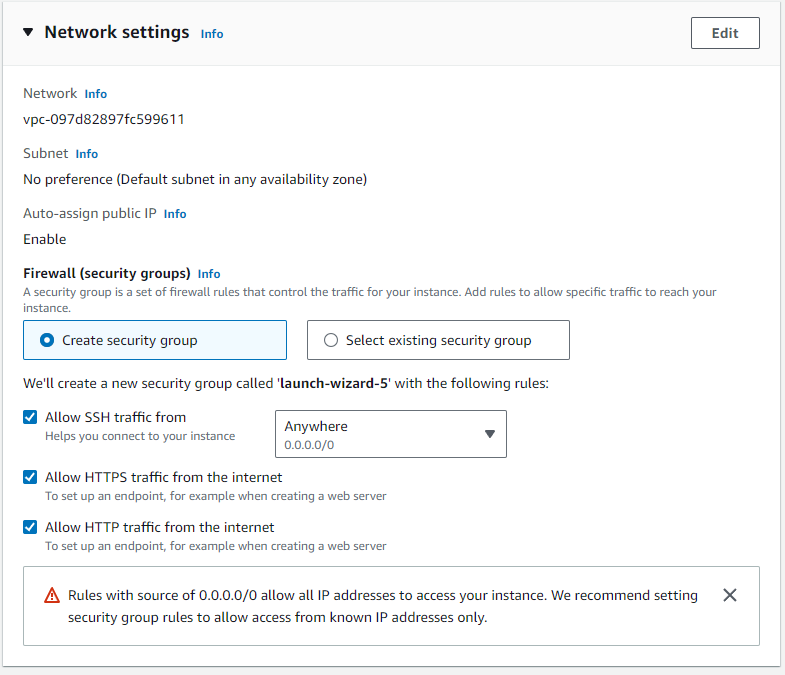
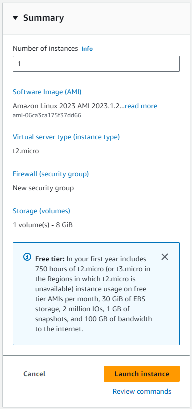

# How to set up an EC2 Instance

1. When we set up an EC2 (Elastic Cloud Compute) instance, the goal is to set up a server with the resources required to effectively run our application. As technology advances, we've shifted gears from vertical scaling to horizontal scaling in terms of deploy server resources. We want to get a server running as quick as possible to get everything started. Start by navigating to the EC2 dashboard

2. After clicking the big orange "Launch Instance" button, you should be taken to a page for configuration. We set things with the following settings.

- Name should be something to describe your application with since that's what will run on this ec2 instance.

- Next look at the AMI (Amazon Machine Image) which basically describes the underlying OS it should build the ec2 on. It's in our best interest to stick to free things so we'll opt for amazon linux (this should be the default, your screen should look like the image below)

- Similarly the default (and free-tier eligible) instance type should be t2.micro, if it's not that, set it to that.

3. You'll need to get a key for your ec2 (this will be helpful to create a secure connection to your ec2 from your local machine). Click create key pair and provide a name, the rest of the default settings should be fine. After you create a key pair, it'll download the private key to your machince... DO NOT LOSE THIS OR POST IT. It's used for making secure connections to your ec2, if you let it out there people will take advantage.

4. For network settings we want to make sure we allow both https and http traffic by clicking the check boxes below.

5. In a perfect world this should all be set up correctly, your side panel should look like below, if it does, you're good to launch your instance and go from there.

