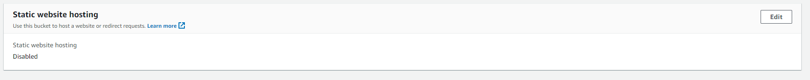

# Setting up an S3

Setting up and S3 bucket is relatively simple and can be useful for all different kinds of storage needs. For this use case, we'll be building a bucket and configuring it so we can deploy our react app to it later as a static website

1. First thing we need to do is to navigate to the S3 dashboard on AWS and click the big orange button that says "Create Bucket"


2. This will pull up the configuration page for our bucket, we'll need to do a couple of things to get ourselves prepared

- First we need to give our bucket a name so AWS knows what to call it. Give it a relevant name as seen below


- Next will be the public access settings. By default, AWS blocks all access to our S3 from outside sources, this is not helpful for us though since we're trying to host a website here, so we'll make sure there are no blocks to public access and acknowledging the warning at the bottom like so


3. We should be able to create our bucket at this time so do that. Once the bucket is up, navigate to the properties pane inside the bucket summary


We went here because we want to enable static web hosting to allow us to host web pages here. Scroll down to this box and click the edit option in the top right 



From here, add the following settings 
- Enable static web hosting
- Host a static website
- index.html should be set for the Index document


4. Save this and then navigate back to the permissions pane in the bucket summary


Scroll down to bucket policy and click edit, we want to enable access to objects in the bucket, following the guide from AWS, paste this JSON and update the Resource at the bottom with your bucket's arn name (should be available right above where it allows you to enter JSON). The json should look like this 

```JSON
{
    "Version": "2012-10-17",
    "Statement": [
        {
            "Sid": "PublicReadGetObject",
            "Effect": "Allow",
            "Principal": "*",
            "Action": [
                "s3:GetObject"
            ],
            "Resource": [
                "arn:aws:s3:::Bucket-Name/*"
            ]
        }
    ]
}
```


5. At this point you should theoretically be done. Once your web pages are hosted (or your single page application) you should be able to find the link to your page at the static website hosting box (under the properties pane near the bottom).


Clicking this should take you to your index page which hopefully contains your react application

