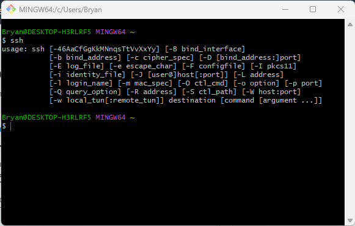
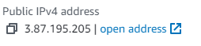
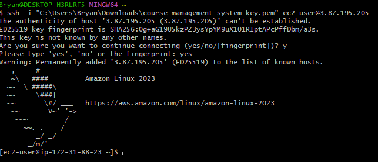
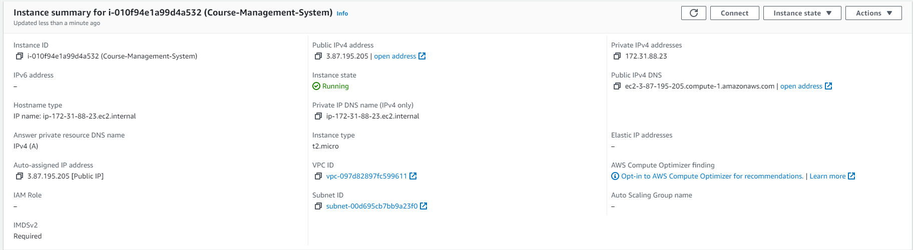
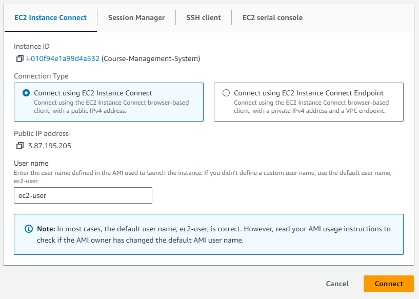

# Connecting to an EC2 Instance

So you want to actually interact with your EC2? You came to the right place. There are 2 major ways of doing this: through the CLI or through the AWS dashboard, let's start with the cli

## SSH into EC2: CLI

1. First thing you should do is open up a new gitbash terminal. Just search up gitbash in your search bar to get started. Try running `ssh` to verify that the command is recognized.

2. Before we can get too far, we should note down the Public IPv4 address of our ec2. Once you go into the instance, it should be near the top middle of the page and look like the following 

3. Time for the actual connection part. Going back to gitbash we're going to enter in the following command `ssh -i "path-to-your-private-key ec2-user@<public IP address>`. Let's break this down. The -i allows us to send in the file for where our private key is for this ec2 instance, hopefully you remember where you put that thing. Next is the ec2-user, this is the default user for an ec2 and if you haven't messed with your users on there, this should work just fine. Finally we add the @ and then paste that ip address from step 2.

You may get asked about trusting the source, this should be a one time thing, just type yes and you should be good to go, if you see the bird and stuff you're in the right place

## SSH into EC2: AWS Dashboard

The AWS dashboard generally provides the _easier_ way to connect to an ec2, though there may be certain cases where you have to use the CLI, so it's important to know both. Realistically, they're just 2 ways of doing the same thing

1. The first step in this connection is gonna be to navigate to the instance summary for your ec2 instance. There should be a nice big button in the top right labelled "Connect". Press this button.

2. You'll be taken to a page where you have the ability to alter what user is accessing the ec2 and stuff like that, if you haven't messed with the users before, ec2-user should be the correct username. Click the big orange "Connect" button at the bottom.

3. You should be in now. It should basically just a giant terminal and have the instance info at the bottom of the page. Once again, if you see the bird you should be in the right spot

